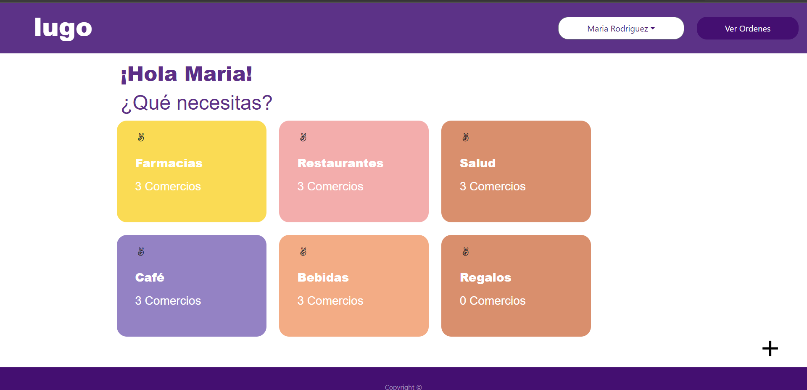
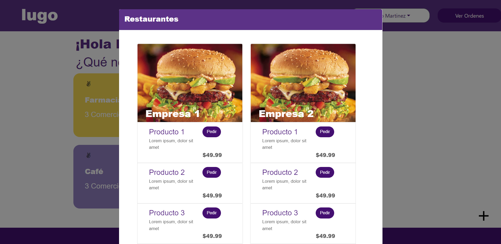
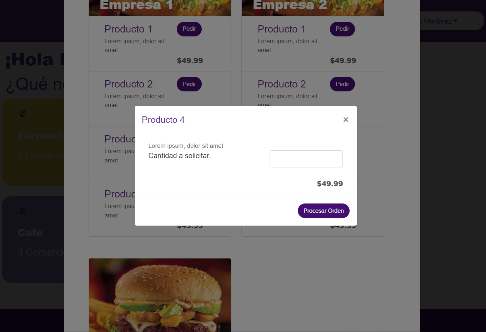
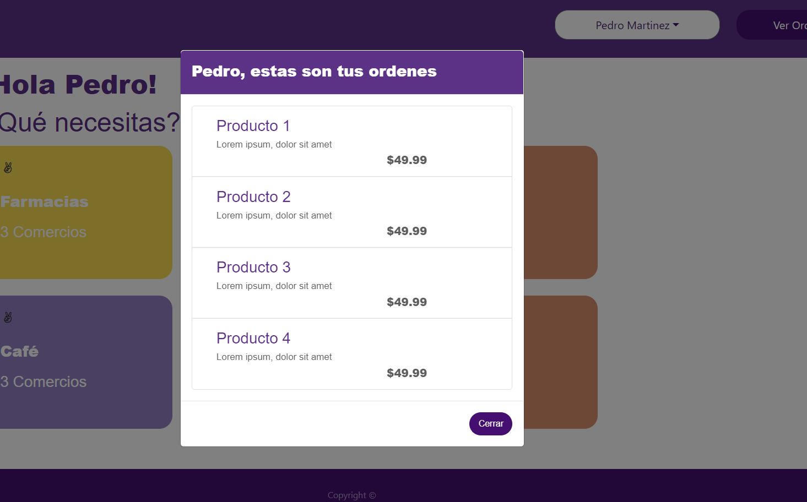

# lugo-app
Clon básico de la aplicación de Hugo

- Clon de una tienda de de artículos variados con diferentes categorías y productos
- Utiliza la API de [Localstorage](https://developer.mozilla.org/en-US/docs/Web/API/IndexedDB_API) para almacenar la data
- Puede agregar y eliminar categorías al igual que productos asociados a dichas categorías

# Vista principal de las categorías

# Productos asociados a dichas categorías

# Un usuario pueden realizar un pedido de ese producto

# Ordenes de compra que ha realizado un usuario 

# Formulario para agregar una categoría
